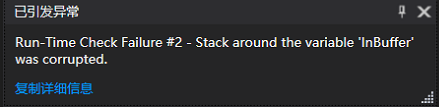
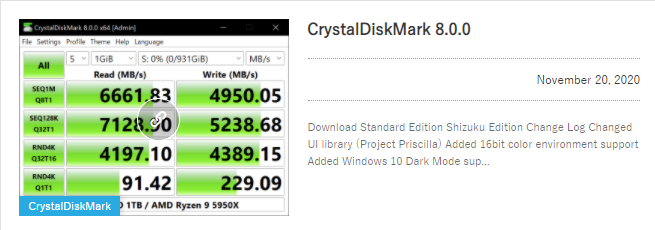

------
> > **目录**
>
> [TOC]
>

------

### DeviceIOControl :ACCESS DENIED

#### 1.DevicelOControl 调用方式不对？

审核了原来的代码，Debug的时候有溢出错误，后来发现是_SFFDISK_DEVICE_COMMAND_DATA结构体中设置的可变长数据区域Data[]在声明时的坑



```C
SFFDISK_DEVICE_COMMAND_DATA：
typedef struct _SFFDISK_DEVICE_COMMAND_DATA {
  USHORT       HeaderSize;
  USHORT       Reserved;
  SFFDISK_DCMD Command;
  USHORT       ProtocolArgumentSize;
  ULONG        DeviceDataBufferSize;
  ULONG_PTR    Information;
  UCHAR        Data[];  //是指针而非固定长度的存储空间
} SFFDISK_DEVICE_COMMAND_DATA, *PSFFDISK_DEVICE_COMMAND_DATA;   
//原版本：
SFFDISK_DEVICE_COMMAND_DATA InBuffer；//直接声明一个结构体
//改进后：
int sizeOfInBuffer = sizeof(SFFDISK_DEVICE_COMMAND_DATA) + sizeof(SDCMD_DESCRIPTOR) + 16;//先计算包括SDCMD_DESCRIPTOR等数据在内的大小
SFFDISK_DEVICE_COMMAND_DATA* InBuffer = (SFFDISK_DEVICE_COMMAND_DATA *)malloc(sizeOfInBuffer); 

```


虽然修改了代码错误，但依然拒绝访问

------

#### 2.[**CrystalDiskMark**](https://crystalmark.info/en/)

> It works by reading and writing through the [filesystem](https://en.wikipedia.org/wiki/Filesystem) in a volume-dependent way. It generates read/write speeds in sequential and random positions with varying numbers of [queues](https://en.wikipedia.org/wiki/Asynchronous_I/O) and [threads](https://en.wikipedia.org/wiki/Thread_(computing)).Solid-state drives tend to excel at random IO, as unlike [hard drives](https://en.wikipedia.org/wiki/Hard_drive) it does not need to [seek](https://en.wikipedia.org/wiki/Hard_disk_drive_performance_characteristics#Seek_time) for the specific position to read from or write to.

PS:源代码在官网下，github上的不全，下标准的代码会附带Diskspd.exe



截取其中关键代码，便是通过拼装命令，多线程以及调用Diskspd实现文件读写：

DiskBench.cpp:

```C
//void DiskSpd(void* dlg, DISK_SPD_CMD cmd) 拼接命令及其格式 
switch (cmd)
	{
	case TEST_READ_0:
........
		index = cmd - TEST_READ_0;
		if (BenchType[index])
		{
			title.Format(L"Random Read");
			option.Format(L"-b%dK -o%d -t%d -W0 -S -w0 -r", BenchSize[index], BenchQueues[index], BenchThreads[index]);
		}
		else
		{
            ......
		}
		maxScore = &(((CDiskMarkDlg*) dlg)->m_ReadScore[index]);
		minLatency = &(((CDiskMarkDlg*)dlg)->m_ReadLatency[index]);
		break;

```

```C
// int ExecAndWait(TCHAR *pszCmd, BOOL bNoWindow, double *latency)
if (hSharedMemory != NULL)
	{
		auto pMemory = (double*)MapViewOfFile(hSharedMemory, FILE_MAP_ALL_ACCESS, NULL, NULL, size);
		if (pMemory != NULL)
		{
			bSuccess = CreateProcess(NULL, pszCmd, NULL, NULL, FALSE, 0, NULL, NULL, &si, &pi);
			//后面就是线程异步处理
            ......
		}
	}
```

```C
//提前定义路径，拼装命令时调用Diskspd.exe实现读写测试
#define DISK_SPD_EXE_32           L"CdmResource\\diskspd\\diskspd32.exe"
#define DISK_SPD_EXE_64           L"CdmResource\\diskspd\\diskspd64.exe"
#define DISK_SPD_EXE_32_LEGACY    L"CdmResource\\diskspd\\diskspd32L.exe"
#define DISK_SPD_EXE_64_LEGACY    L"CdmResource\\diskspd\\diskspd64L.exe"
#define DISK_SPD_EXE_ARM32        L"CdmResource\\diskspd\\diskspdA32.exe"
#define DISK_SPD_EXE_ARM64        L"CdmResource\\diskspd\\diskspdA64.exe"
```

#### [**3.Diskspd**](https://github.com/microsoft/diskspd)

> **DiskSpd** is a [free and open-source](https://en.wikipedia.org/wiki/Free_and_open-source)[[2\]](https://en.wikipedia.org/wiki/DiskSpd#cite_note-2) [command-line tool](https://en.wikipedia.org/wiki/Command-line_interface) for storage [benchmarking](https://en.wikipedia.org/wiki/Benchmark_(computing)) on [Microsoft Windows](https://en.wikipedia.org/wiki/Microsoft_Windows) that generates a variety of requests against [computer files](https://en.wikipedia.org/wiki/Computer_file), [partitions](https://en.wikipedia.org/wiki/Disk_partitioning) or [storage devices](https://en.wikipedia.org/wiki/Computer_data_storage) and presents collected statistics as text in the command-line interface or as an [XML file](https://en.wikipedia.org/wiki/XML).[[3\]](https://en.wikipedia.org/wiki/DiskSpd#cite_note-3)[[4\]](https://en.wikipedia.org/wiki/DiskSpd#cite_note-4)[[1\]](https://en.wikipedia.org/wiki/DiskSpd#cite_note-auto-1)
>
> ```
> diskspd -c50M -d10 H://使用50 MB的测试文件对驱动器H:进行基准测试，并运行10秒
> ```
>
> 


Diskspd项目由七个部分组成：


```C
CmdLineParser:命令处理
IORequestGenerator:IO //主要查看的就是此部分IO操作，其读写主要通过ReadFileex,WriteFileex，ReadFile，WriteFile实现
```

```
hFile = CreateFile(fname,
                dwDesiredAccess,
                FILE_SHARE_READ | FILE_SHARE_WRITE,
                nullptr,        //security
                OPEN_EXISTING,
                dwFlags,        //flags
                nullptr);       //template file
```

```
    rslt = DeviceIoControl(hFile,
                            IOCTL_VOLUME_GET_VOLUME_DISK_EXTENTS,
                            NULL,
                            0,
                            pDiskExt,
                            sizeof(VOLUME_DISK_EXTENTS),
                            &bytesReturned,
                            &ovlp);
```

通过以上两个项目的代码：1.主要通过Read/WriteFile实现读写IO  2.通过 CreateFile-DeviceIOControl应该是可以实现的


但是始终没有发现有关ACCESS DENIED的处理。

一开始认为CreateFile权限设置 FILE_SHARE_READ | FILE_SHARE_WRITE，GENERIC_READ|GENERIC_WRITE,只有这种读写权限，可是这个权限貌似只能进行类似文件读写，可能不是更深层次，涉及CSD,CID等寄存器的读写


### [关于CreateFile权限的猜测：](http://windows.bytekits.com/wdm/windrv-createfile-iocreatedevice-access.html)

> The most commonly used values are **GENERIC_READ**, **GENERIC_WRITE**, or both (`GENERIC_READ | GENERIC_WRITE`). For more information, see [Generic Access Rights](https://docs.microsoft.com/en-us/windows/desktop/SecAuthZ/generic-access-rights), [File Security and Access Rights](https://docs.microsoft.com/en-us/windows/desktop/FileIO/file-security-and-access-rights), [File Access Rights Constants](https://docs.microsoft.com/en-us/windows/desktop/FileIO/file-access-rights-constants), and [ACCESS_MASK](https://docs.microsoft.com/en-us/windows/desktop/SecAuthZ/access-mask).            ------MSDN

-------

根据[CreateFile打开驱动设备权限不足](http://windows.bytekits.com/wdm/windrv-createfile-iocreatedevice-access.html)这篇文章，之前使用的[CreateFile](https://docs.microsoft.com/en-us/previous-versions/ms959950(v=msdn.10))一直在是在用户模式下，这可能是导致ACCESS DENIED的原因。根据[资料](https://community.osr.com/discussion/261406/accessing-usermode-file-handle-from-kernel)：

> If you have a handle from user mode, use ObReferenceObjectByHandle to get a pointer to the object, and then ObOpenObjectByPointer to create a kernel mode handle for it.

打算尝试：

* 以CreateFile返回句柄为参数，使用[ObReferenceObjectByHandle](https://docs.microsoft.com/en-us/windows-hardware/drivers/ddi/wdm/nf-wdm-obreferenceobjectbyhandle)，得到一个对象指针；
* 然后使用对象指针，通过函数[ObOpenObjectByPointer](https://docs.microsoft.com/en-us/windows-hardware/drivers/ddi/ntifs/nf-ntifs-obopenobjectbypointer)得到一个内核状态下的handle；
* 通过这个handle来测试之前的`read_ext_csd`函数。

这次尝试可能会用到较多Windows系统相关知识，参考如下：

> <https://rayanfam.com/topics/reversing-windows-internals-part1/>              ------快速handle教程

[下载此文档](./ioctl_3.zip)