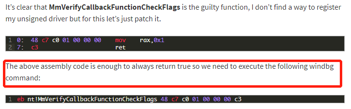
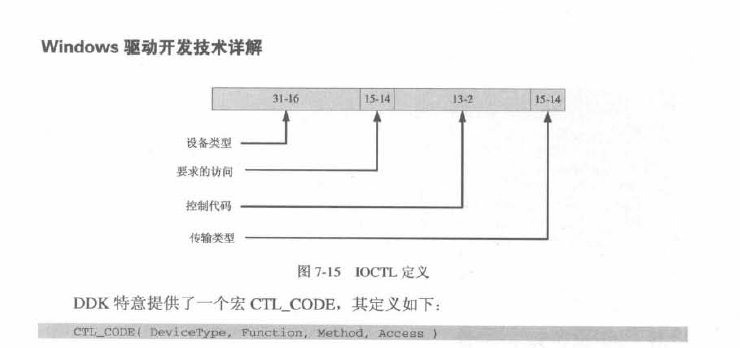
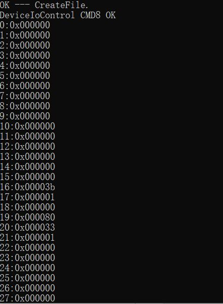

# [关于CreateFile权限的猜测：](http://windows.bytekits.com/wdm/windrv-createfile-iocreatedevice-access.html)的验证

> 根据[资料](https://rayanfam.com/topics/reversing-windows-internals-part1/)，笔者也遇到了权限被否决的问题，最后给出的方式是在二进制文件中注入一行二进制代码，以直接跳过验证权限，考虑到操作性不高，这个方法不被采用
>
> 

根据[CreateFile打开驱动设备权限不足](http://windows.bytekits.com/wdm/windrv-createfile-iocreatedevice-access.html)这篇文章，由于笔者是在驱动开发的环境下进行测试，因此，查阅书籍《Windows 驱动开发详解》，第七章第五节**`DeviceIoControl`与驱动交互**


> 预备知识点：
>
> * IRP，用户模式下所有对驱动程序的IO请求，全部都由操作系统转化为一个叫IRP的数据结构，即输入，输出请求包。它是与输入输出相关的数据结构，上层应用程序与底层驱动程序通信时，应用程序会发出I/O请求。操作系统将I/O请求转化为相应的IRP数据，不同类型的IRP会根据类型传递到不同的**派遣函数**内。
> * 如果应用程序要对一个设备进行操作，程序员需要自定义一种I/O控制码，然后使用`DeviceIoControl`函数，将这个控制码和请求一起传递给驱动程序。在派遣函数中，分别对不同的I/O控制码进行处理。

要实现在应用程序上调用IO操作，需要使用`DeviceIoControl`与驱动进行交互。

```c++
BOOL DeviceIoControl(
  HANDLE       hDevice,
  DWORD        dwIoControlCode,  // 控制码
  LPVOID       lpInBuffer,
  DWORD        nInBufferSize,
  LPVOID       lpOutBuffer,
  DWORD        nOutBufferSize,
  LPDWORD      lpBytesReturned,
  LPOVERLAPPED lpOverlapped
);
```

对于第二个参数，需要使用宏[CTL_CODE](https://social.technet.microsoft.com/wiki/contents/articles/24653.decoding-io-control-codes-ioctl-fsctl-and-deviceiocodes-with-table-of-known-values.aspx?Sort=MostUseful&PageIndex=1#Decoding)产生正确的控制码



微软头文件已经预定义了一些操作码，

```c
//
// IOCTL codes.
//

#define IOCTL_SFFDISK_QUERY_DEVICE_PROTOCOL \
            CTL_CODE( FILE_DEVICE_DISK, 0x7a0, METHOD_BUFFERED, FILE_ANY_ACCESS)

#define IOCTL_SFFDISK_DEVICE_COMMAND \
            CTL_CODE( FILE_DEVICE_DISK, 0x7a1, METHOD_BUFFERED, FILE_WRITE_ACCESS)

#define IOCTL_SFFDISK_DEVICE_PASSWORD \
            CTL_CODE( FILE_DEVICE_DISK, 0x7a2, METHOD_BUFFERED, FILE_WRITE_ACCESS)

#define IOCTL_SFFDISK_PARTITION_ACCESS \
            CTL_CODE( FILE_DEVICE_DISK, 0x7a3, METHOD_BUFFERED, FILE_ANY_ACCESS)

#define IOCTL_SFFDISK_MMC_SOFT_RESET \
            CTL_CODE( FILE_DEVICE_DISK, 0x7a4, METHOD_BUFFERED, FILE_ANY_ACCESS)

#define IOCTL_SFFDISK_MMC_QUERY_EXT_CSD \
            CTL_CODE( FILE_DEVICE_DISK, 0x7a5, METHOD_BUFFERED, FILE_ANY_ACCESS)

#define IOCTL_SFFDISK_MMC_QUERY_BKOPS_STATE \
            CTL_CODE( FILE_DEVICE_DISK, 0x7a6, METHOD_BUFFERED, FILE_ANY_ACCESS)
```

《Windows 驱动开发详解》提及到，一般`CTL_CODE`的`Access`参数是FILE_ANY_ACCESS，而之前使用的是宏`IOCTL_SFFDISK_DEVICE_COMMAND`，即`Access`参数不是FILE_ANY_ACCESS；我们尝试将`IOCTL_SFFDISK_DEVICE_COMMAND`第四个参数改成了'FILE_ANY_ACCESS'。在实验电脑上运行，**成功**，而且**不需要管理员模式**，



但是，新的问题出现，输出结果不是预期结果。

#### 对于结果的分析

1.确定之前拒绝访问的原因为：微软官方对IOCTL_SFFDISK_DEVICE_COMMAND权限定义为FILE_WRITE_ACCESS因此只能进行write相关命令发送

2.虽然我们可以自定义CTL_CODE,当其对应的实现已经封装在驱动之中，所以如果不是驱动中定义好的功能，我们只能自己编写其他驱动程序，并实现才可以使用自定义的CTL_CODE。同时尝试直接更改FILE_WRITE_ACCESS为FILE_ANY_ACCESS并不可行，原因同上，函数已经封装在WDK中，更改后与微软定义的CTL_CODE不符合会出现函数错误。


CTL_CODE：[0x800以下为微软定义](https://social.technet.microsoft.com/wiki/contents/articles/24653.decoding-io-control-codes-ioctl-fsctl-and-deviceiocodes-with-table-of-known-values.aspx?Sort=MostUseful&PageIndex=1#Decoding)

